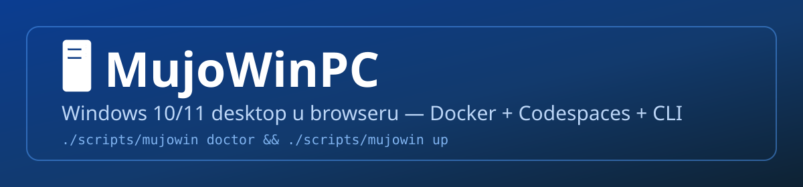
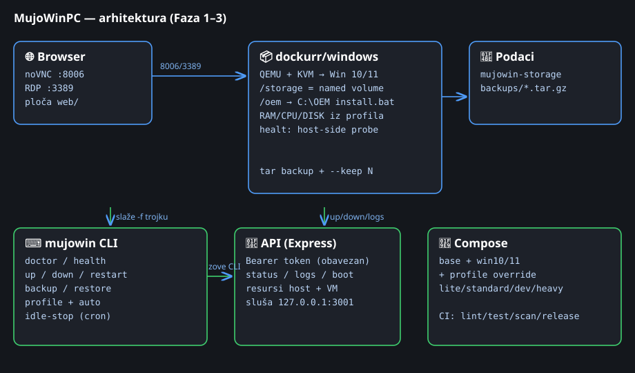
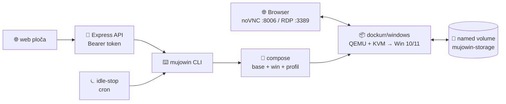
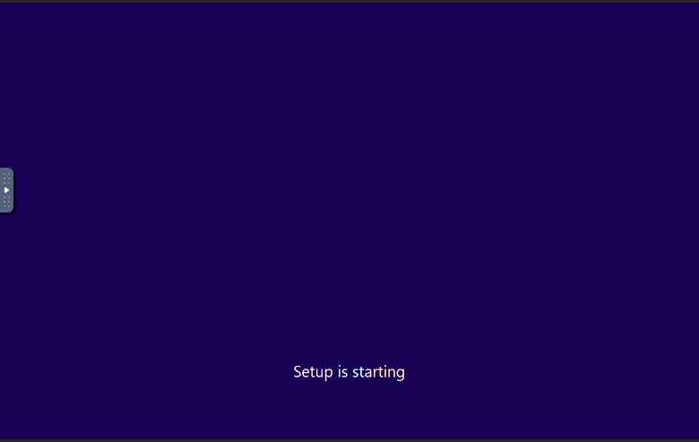
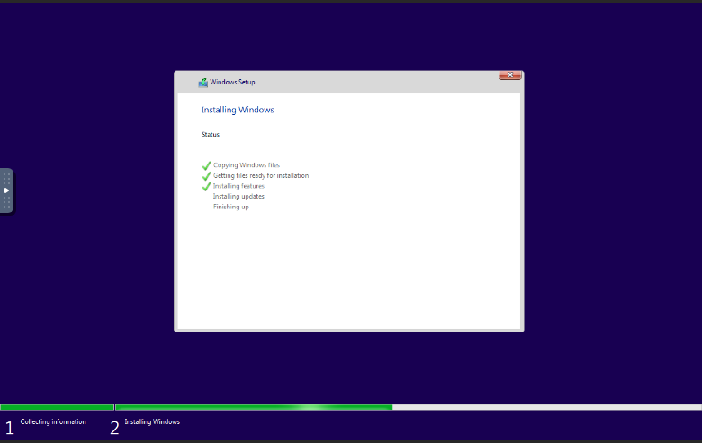
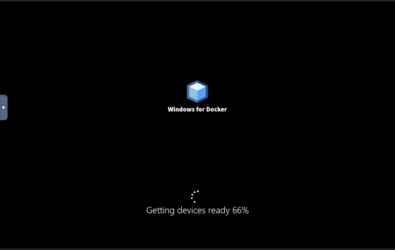
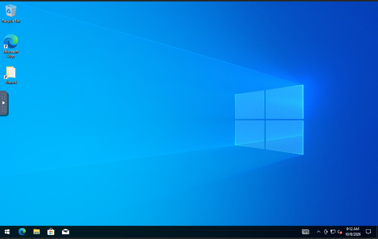
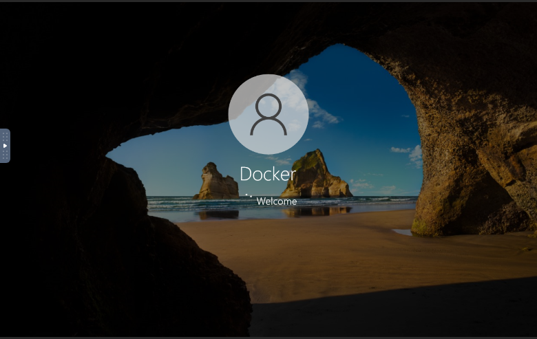
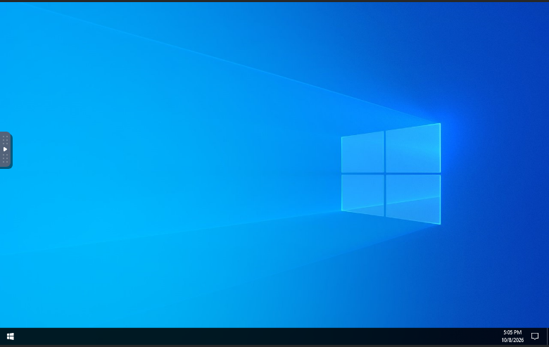

<div align="center">
  
  <p>
    <a href="LICENSE"></a>
    <a href="https://github.com/xnet-ba/MujoWinPC/actions/workflows/ci.yml"></a>
    <a href="https://github.com/xnet-ba/MujoWinPC/releases"></a>
    
    
    
  </p>
  <p><b>Windows 10/11 desktop u browseru</b> — Docker + Codespaces + CLI + profili + kontrolna ploča.<br>
  🇧🇦 <a href="#mujowinpc">Bosanski</a> • 🇬🇧 <a href="#english-short-version">English</a></p>
</div>

---

## <a id="mujowinpc"></a>🖥️ MujoWinPC

<table>
<tr>
<td width="50%">

### Šta JESTE ✅
Kompletan, održiv projekat oko slike `dockurr/windows`: profili resursa, `mujowin` CLI s doctorom, backup/restore s rotacijom, host-side health, idle auto-stop, token-zaštićen API, statična ploča bez ijedne eksterne biblioteke, CI sa skeniranjem image-a i release tokom.

</td>
<td width="50%">

### Šta NIJE ❌
- ❌ Fork s jednom compose datotekom
- ❌ Distribucija Windowsa (slika skida sistem sama)
- ❌ Tvrdnja da radi bez KVM-a
- ❌ Follow-gate — iz uzora je **uklonjen**, ništa ne traži praćenje ičijeg naloga

</td>
</tr>
</table>

### 🏗️ Kako je složeno





<details>
<summary><b>🧩 Komponente ukratko</b></summary>

| Sloj | Fajlovi | Uloga |
|---|---|---|
| 🧩 Compose | `compose/base.yml`, `win10/11.yml`, `profile-*.yml` | baza + 2 Windows overridea + 4 profila; CLI uvijek slaže tačno 3 fajla |
| ⌨️ CLI | `scripts/mujowin`, `lib/common.sh`, `idle-stop.sh` | jedini način upravljanja; odbija start bez lozinke |
| 🌐 Ploča | `web/index.html`, `style.css`, `app.js` | statična + live dio; bs/en, tamna/svijetla, 0 zavisnosti |
| 🔌 API | `server/*.js` (express jedina zavisnost) | status, start/stop, logovi, resursi, boot faza; token obavezan |
| 💾 Podaci | named volume + `backups/*.tar.gz` | tar backup s `--keep N` rotacijom |
| 🏭 OEM | `oem/install.bat` + `packages*.txt` | winget instalacije na svježoj instalaciji |
| ✅ CI | `.github/workflows/` | lint, testovi, compose matrica, HTML, Trivy, release |

</details>

---

## ✨ Ključne mogućnosti

| | Mogućnost | Detalj |
|---|---|---|
| 🩺 | `doctor` | /dev/kvm, TUN, Docker, RAM/CPU/disk, lozinka, portovi + **preporuka profila** |
| 🚀 | `up/down/restart/status/logs` | start se **odbija** bez prave lozinke; upozorava bez KVM-a |
| 💓 | `health` | host-side provjera: kontejner + TCP probe 8006/3389 (in-container healthcheck namjerno izostavljen — [zašto](docs/ROADMAP.md)) |
| 📊 | `profile lite/standard/dev/heavy/auto` | `auto` bira prema hostu |
| 💾 | `backup --keep N / restore` | tar volumena + rotacija; destruktivno traži ukucanu potvrdu |
| ⏾ | `idle-stop.sh` | gasi VM kad nema konekcija (cron primjer u fajlu) |
| 🔌 | API + live ploča | Bearer token, 127.0.0.1, bez izlaganja Docker socketa |
| 🏭 | OEM paketi | default / dev / office winget liste |
| 🖥️ | Windows 10 **i** 11 | odvojeni compose overridei |

---

## 🚀 Brzi start (Codespaces)

> Uslov: GitHub nalog. KVM u Codespacesu tipično **ne postoji** — očekuj spor rad ili neuspjeh bez KVM hosta; `doctor` to jasno prijavljuje.

1. Forkuj repo → **Code → Create codespace** (ili `gh codespace create -r xnet-ba/MujoWinPC`)
2. `cp .env.example .env` i upiši **jaku** `WINDOWS_PASSWORD`
3. `./scripts/mujowin doctor` — pročitaj preporuku profila
4. `./scripts/mujowin profile auto` (ili ručno)
5. `./scripts/mujowin up` → forwarded port **8006** stavi na **Public**, otvori noVNC
6. Prijavi se podacima iz `.env` • RDP: port 3389, samo kad treba
7. Kad sve radi: `./scripts/mujowin backup` • Kad ne koristiš: `mujowin down`

📖 Detaljna checklista: [`docs/FIRST_START.md`](docs/FIRST_START.md) • Lokalni Linux / VPS razlike: [`docs/HOSTS.md`](docs/HOSTS.md)

---

## ⌨️ CLI referenca

```
mujowin doctor            provjera okruženja + preporuka profila
mujowin health            kontejner + TCP probe portova s hosta
mujowin up                start (odbija bez lozinke; upozorava bez KVM-a)
mujowin down / restart    stop / restart (podaci ostaju u volumenu)
mujowin status [--json]   stanje (json za API)
mujowin logs [-f]         logovi (praćenje uživo)
mujowin reset             BRIŠE volumen — traži ukucano OBRISI-SVE
mujowin backup [ime] [--keep N]   tar + rotacija (VM treba biti zaustavljen)
mujowin restore <tar>     vraćanje (VM mora biti zaustavljen + potvrda)
mujowin profile <ime>|auto  lite / standard / dev / heavy / auto
scripts/idle-stop.sh [--check]     gase VM kad nema konekcija (cron)
```

---

## 📊 Profili resursa

| Profil | RAM | CPU | Disk | Za koga |
|---|---|---|---|---|
| `lite` | 4G | 2 | 32G | slabi hostovi, proba |
| `standard` | 8G | 4 | 64G | svakodnevni rad |
| `dev` | 12G | 4 | 80G | razvoj u VM-u |
| `heavy` | 16G | 8 | 128G | samo jaki hostovi |
| `auto` | ↳ | ↳ | ↳ | bira `doctor` logika prema hostu |

`DISK_SIZE` vrijedi za **novi** volumen — ne resizea postojeći.

---

## 🔌 Kontrolni API

```bash
cd server && npm install
MUJO_API_TOKEN=$(openssl rand -hex 32) node index.js   # ili MUJO_MOCK=1 npm run dev
```

| Endpoint | Auth | Opis |
|---|---|---|
| `GET /api/health` | ne | `{ok, mock}` |
| `GET /api/status` | da | radi li VM |
| `POST /api/up` `/down` `/restart` | da | akcije kroz CLI |
| `GET /api/logs?tail=100` | da | zadnje linije |
| `GET /api/resources` | da | host CPU/RAM/disk + VM profil |
| `GET /api/boot` | da | boot faza (**best-effort** heuristika iz logova) |

Server servira i ploču (isti port), sluša `127.0.0.1:3001`, token u `sessionStorage` (nestaje sa tabom).

---

## ⚙️ Konfiguracija (.env)

`WINDOWS_VERSION` (10/11) • `MUJO_PROFILE` • `WINDOWS_USERNAME` • `WINDOWS_PASSWORD` (obavezna, ne defaultna) • `WEB_PORT`/`RDP_PORT` • `MUJO_API_TOKEN` (`openssl rand -hex 32`) • `MUJO_API_PORT` • `MUJO_API_BIND` (127.0.0.1 — ne mijenjaj bez TLS-a). `.env` je gitignorean — nikad ga ne commitaj s pravom lozinkom.

---

## 🔒 Sigurnost (sažetak)

Lozinke samo iz `.env` • RDP/noVNC javno samo dok se spajaš, inače Private • noVNC u ovoj fazi bez svoje lozinke (zaštita = vidljivost porta) • Docker socket se nigdje ne mounta • API: token + localhost • OEM skripte se izvršavaju kao SYSTEM — reviewaj svaku liniju. Detalji: [`docs/SECURITY.md`](docs/SECURITY.md). Za osjetljive podatke sačekaj TLS/audit (roadmap).

---

## 🖥️ Hostovi

| | Codespaces | Lokalni Linux + KVM | VPS |
|---|---|---|---|
| KVM | tipično ❌ | ✅ (preporučeno) | provjeri (OpenVZ/LXC ❌) |
| Idle | 30 min default (5–240) | tvoj cron | tvoj cron |
| Portovi | Public/Private toggle | SSH tunnel | firewall samo za tvoju IP |

Detalji: [`docs/HOSTS.md`](docs/HOSTS.md)

---

## ⚠️ Ograničenja

- **Nema GPU-a** — grafika ide preko noVNC-a.
- Bez `/dev/kvm` praktično neupotrebljivo (softverska emulacija).
- Brojke o Codespaces satima, veličini image-a i vremenima boot-a **namjerno ne navodimo** — mijenjaju se; provjeri GitHub/dockur docs.
- Šta preživljava stop/brisanje Codespacea: djelimično neprovjereno — redovno radi `mujowin backup`.

---

## 🗺️ Roadmap (sažetak)

Core ✅ • DX ✅ • Sigurnost 🔄 • Performanse ✅ • Backup ✅ • Automatizacija ✅ • UX ✅ • Hostovi ✅/🔄 • Docs ✅ • CI ✅. Pojedinačno s težinama S/M/L: [`docs/ROADMAP.md`](docs/ROADMAP.md). Preostalo netestirano na pravom KVM hostu: boot, OEM winget, snimci ekrana.

---

## ❓ Česta pitanja

<details><summary><b>Da li mi treba Windows licenca?</b></summary>Da. Ti sam odgovaraš za valjanu licencu i Microsoftove uslove. Slika koristi generičke instalacijske ključeve koji nisu aktivacija.</details>
<details><summary><b>Šta ako nema /dev/kvm?</b></summary>Softverska emulacija — ekstremno sporo ili nikako. Treba ti host s KVM-om. <code>mujowin doctor</code> to jasno kaže.</details>
<details><summary><b>Da li podaci preživljavaju restart?</b></summary>Restart kontejnera i stop/start: da (named volume). <code>reset</code> ili brisanje Codespacea: ne. Backup: <code>mujowin backup --keep 5</code>.</details>
<details><summary><b>Ima li GPU?</b></summary>Ne — grafika preko noVNC-a.</details>
<details><summary><b>Zašto nema healthchecka u composeu?</b></summary>dockur image je minimalni rootfs bez garantovanog HTTP klijenta — pogrešan test bi flappingovao zdrave VM-ove. Zato host-side <code>mujowin health</code>.</details>
<details><summary><b>Koliko troši Codespaces sati?</b></summary>Codespace se gasi nakon idle timeouta (default 30 min, podesivo 5–240). <code>idle-stop.sh</code> gasi VM i ranije kad niko nije spojen.</details>
<details><summary><b>Kako da dobijem gotove aplikacije u VM-u?</b></summary>Prije prvog starta kopiraj <code>oem/packages-dev.txt</code> ili <code>packages-office.txt</code> na <code>oem/packages.txt</code> — instaliraju se wingetom na svježoj instalaciji.</details>
<details><summary><b>Gdje prijavim grešku?</b></summary>Issues s <code>mujowin doctor</code> izlazom (bez lozinke!) — šablon te vodi.</details>

---

## 📸 Snimci ekrana

_Pravi kadrovi sa smoke testa (TCG emulacija bez KVM-a, dockur v6.06):_








> Cijeli ciklus dokazan na hostu bez KVM-a (emulacija): ISO download → Setup → desktop → `tar` backup (5.3 GB) → restore u novi volumen → boot → login → desktop. Prva dva kadra i zadnja dva su prije/poslije restorea.

---

## 🤝 Doprinos

Vidi [`CONTRIBUTING.md`](CONTRIBUTING.md) + [`docs/DEVELOPMENT.md`](docs/DEVELOPMENT.md): `make lint && make test` prije PR-a, conventional commits, web ostaje na nula zavisnosti.

## 📄 Licenca

MIT — [`LICENSE`](LICENSE) (© 2026 xnet-ba). Izvorni pc-free repoui nemaju LICENSE fajl (provjereno), pa se ne prenosi tuđi copyright notice.

## 🙏 Acknowledgments

- [jephersonRD/PC-Free](https://github.com/jephersonRD/PC-Free) — originalna ideja
- [Chieji/pc-free](https://github.com/Chieji/pc-free) — fork kao polazna tačka (follow-gate uklonjen)
- [dockurr/windows](https://github.com/dockur/windows) — Docker Windows slika (MIT)

**Pravna napomena:** ti sam odgovaraš za valjanu Windows licencu i poštovanje Microsoftovih uslova i uslova dockurr/windows. Ključevi u dockur kodu su generički instalacijski i nisu aktivacija.

---

## <a id="english-short-version"></a>🇬🇧 English (condensed)

MujoWinPC runs a **Windows 10/11 desktop in your browser** using the `dockurr/windows` Docker image — on GitHub Codespaces or any KVM host.

- **CLI** (`scripts/mujowin`): `doctor` (env check + profile advice), `health` (host-side probes), `up/down/restart/status/logs`, `reset` (typed confirmation), `backup --keep N` / `restore`, `profile lite|standard|dev|heavy|auto`, plus `idle-stop.sh` for cron-based VM shutdown.
- **No default passwords** — `up` refuses to start without a real `WINDOWS_PASSWORD` in `.env`.
- **Static + live dashboard** (`web/`, zero dependencies, BS/EN, dark/light) backed by a token-authenticated **Express API** (`server/`, Bearer token required, binds 127.0.0.1, never exposes the Docker socket).
- **OEM post-install** via winget lists (default/dev/office), **named volume** persistence, **CI** (shellcheck, compose matrix, HTML validation, tests, Trivy scan) and **releases** on `v*` tags.
- **No GPU**; without `/dev/kvm` the VM is emulated and practically unusable. No unverified numbers are quoted — check the official GitHub/dockurr docs for quotas and image sizes.
- **You are responsible** for a valid Windows license and Microsoft's terms. MIT licensed. Full docs in [`docs/`](docs/ROADMAP.md).
